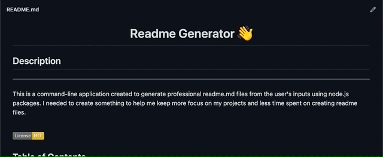

<h1 align="center">ReadMe Generator 👋</h1> 
 
## Description 

This is a command-line application created to generate professional readme.md files from the user's inputs using node.js packages. I needed to create something to help me keep more focus on my projects and less time spent on creating readme files. 

    I learned: 
        * node.js
        * how node packages work
        * working with promises
        * inquirer package
        * generating files
        * badges
    
    Things I further understood:
        * JavaScript (const, prompts, init)

 

    

## Table of Contents

* [Description](#Description)
* [Installation](#Installation)
* [Usage](#Usage)
* [Authors](#Authors)
* [License](#License)
* [Questions](#Questions)
    
## Installation 

Install node.js if you already haven't. Below is a link to instrutions on how to do that. 

[coding bootcamp: how to install node.js](https://coding-boot-camp.github.io/full-stack/nodejs/how-to-install-nodejs)

 

To install necessary dependencies, run the following command:  
    
    npm i

## Usage

Make sure Node.js is installed.  
From the terminal run:  

- npm i (to install packages)
- node index.js (to run application)
- answer the questions
- your new readme will be in the newRead file after you answer the questions

✨ Demo: 
 
<iframe src="https://drive.google.com/file/d/1arjNq_sV6vcp9jlJuykLni-E6XVJxfA1/preview" width="100%"></iframe>
 
 
Results:
 
Checkout the results in the newRead folder or in the gif below.
 
 

## Contribute

Please don't hesitate to let me know anything I can update or change. If I like it I'll add it. Thank you.

 

## License

Copyright © 2021 Danielle Orley 

licensed under MIT  

## Questions

If you have any questions please see contact information below.  
 My GitHub Username: [dorley1993](http://github.com/dorley1993)
    
 My Contact Email: daniorley1993@gmail.com
